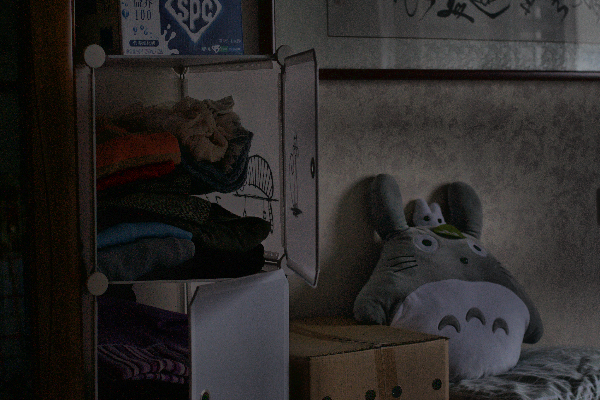
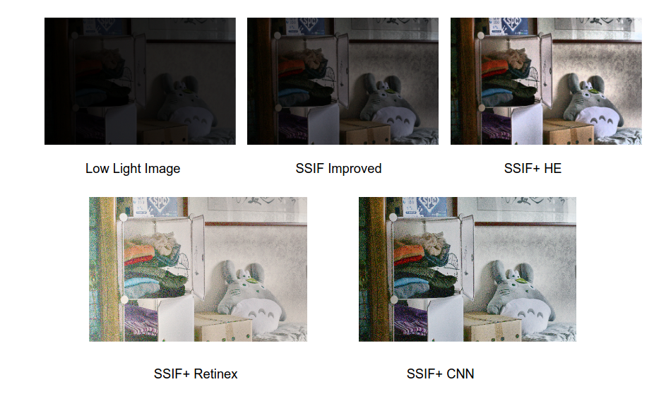

# Low-Light Image Enhancement using SSIF

This project implements several advanced techniques for enhancing images captured in low-light conditions. The core focus is on **SSIF (Side Window Guided Filter)**, along with other popular methods including histogram-based, retinex-based, and deep learning-based approaches.

## 🌟 Features

- **SSIF (Side Window Guided Filter)**:
    - `SSIF_2Step.ipynb`: A two-step implementation of the SSIF algorithm for edge-preserving smoothing and enhancement.
    - `SSIF_3Steps.ipynb`: A refined three-step process for superior detail restoration.
- **Histogram-Based Methods**:
    - Standard Histogram Equalization (HE).
    - Variational Regularization HE (CLAHE + Total Variation denoising).
- **Retinex-Based Methods**:
    - Single-Scale Retinex (SSR).
    - Multi-Scale Retinex with Color Restoration (MSRCR).
- **Learning-Based Methods**:
    - **Zero-DCE**: Zero-Reference Deep Curve Estimation for rapid, non-reference based enhancement.

## 📁 Project Structure

```text
.
├── README.md               # Project documentation
├── images/                 # Sample input and result visuals
│   ├── input.png           # Original low-light image
│   ├── output.png          # Enhanced result using SSIF
│   └── comparison.png      # Comparison between various methods
└── notebook/               # Execution notebooks
    ├── SSIF_2Step.ipynb    # 2-Step SSIF Implementation
    ├── SSIF_3Steps.ipynb   # 3-Step SSIF Implementation
    ├── ssif-gaussian-blur.ipynb   # SSIF with Gaussian blurring
    ├── ssif-denoise-gamma.ipynb   # SSIF with denoising gamma correction
    └── SSIF_enhancement.ipynb # Comprehensive guide with multiple methods
    
```

## 🛠️ Dependencies

To run the notebooks, ensure you have the following Python libraries installed:

- `opencv-python` (cv2)
- `numpy`
- `matplotlib`
- `scipy`
- `torch`
- `torchvision`
- `ipywidgets` (for interactive elements)

You can install them via pip:
```bash
pip install opencv-python numpy matplotlib scipy torch torchvision ipywidgets
```

## 🚀 Usage

1. Open any of the notebooks in the `notebook/` directory using Jupyter Lab or Kaggle.
2. Follow the internal instructions to upload your low-light image or use the pre-configured paths.
3. Run the cells sequentially to see the step-by-step enhancement process and final visualizations.

## 📊 Visuals

### SSIF Enhancement Result


### Method Comparison

